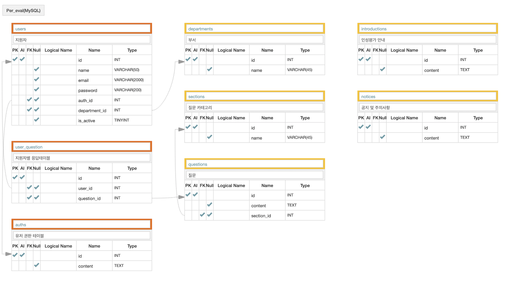

## PersonalityAssessment_backend
 

## Introduction

- Gopizza 면접자 인성평가 및 관리 시스템 개발
- 구성: 프론트엔드 2명, 백엔드 2명
- 기간: 2020년 7월 06일 - 2020년 7월 16일

 
## DB Modeling

 
## Technologies

- python
- Django Web  Framework
- MySQL
- JWT, BCrypt
- Json
- CORS headers
- Git, Github
 
## Features

### User
 - BCrypt를 사용하여 유저 패스워드 암호화
 - JWT를 사용하여 유저 인증 Token 생성
 - SMTP를 이용한 인증 메일 발송
 - url에 담긴 토큰과 유저 UID를 통한 인증 
 - PasswordRestTokenGenerator를 통해 유저 토큰 발행
 
 ### Eval
 - 인성평가 문제 리스트 출력
 - 응시자별 평가 결과 확인 및 저장
 - 유저별 권한 부여 및 권한별 응시 결과 제한 및 출력

